<div align="center">

<h3><code>nilesh@github ~ $ ./contributions.sh</code></h3>


</div>

<br>

<div align="center">

<br><br>


<br><br>
<a href="[https://nileshraj-portfolio.vercel.app/]"></a>
<a href="https://www.linkedin.com/in/nilesh-raj-nr1735/"></a>
<a href="mailto:nileshraj1735@gmail.com"></a>
<a href="https://github.com/Nilesh1735"></a>
<br><br>


</div>

### `> whoami`
AI/ML Engineer & Forward Deployed Engineer (FDE) delivering production-grade agentic AI applications and ML pipelines directly to client environments. I bridge the gap between complex AI architecture (LangGraph, BERT, PyTorch) and client-facing deployment (Docker, FastAPI), shipping secure, scalable microservices that stakeholders can actually use.

```bash
$ cat .profile

ROLE        =  AI/ML Engineer | Forward Deployed Engineer (FDE)
EXP         =  BCA Graduate (AI & DS) | Former AI/ML Trainee
DOMAIN      =  Generative AI  |  Agentic Workflows  |  MLOps
STACK       =  Python  |  LangGraph  |  CrewAI  |  FastAPI  |  Docker
AI_INFRA    =  FAISS  |  Mistral/OpenAI  |  MongoDB  |  Redis
LOCATION    =  India
OPEN_TO     =  AI/ML Engineer Roles  +  Forward Deployed Positions
```

### `> ls /tech-stack`

**[ Languages ]**
<div align="center">
  
  
</div>

**[ AI / ML & GenAI ]**
<div align="center">
  
  
  
  
  
  
</div>

**[ Backend, DB & Infra ]**
<div align="center">
  
  
</div>

**[ Cloud & DevOps ]**
<div align="center">
  
  
  
</div>

### `> cat specialty-badges.sh`
<div align="center">
  
  
  
</div>

### `> cat expertise.json`
<div align="center">
 
| Domain | Details |
| :--- | :--- |
| **Agentic AI** | LangGraph, CrewAI, Multi-Agent Systems, ReAct Framework |
| **RAG & Enrichment** | LangChain, FAISS, Snov.io API, Dynamic Query Routing |
| **LLM Integration** | Mistral AI, OpenAI, Google Gemini, NVIDIA NIM, Ollama |
| **Deployment (FDE)** | Docker, FastAPI, Render, Vercel, WebSocket Telemetry |
| **Machine Learning** | Scikit-learn, PyTorch, BERT, Hugging Face |
| **AppSec** | JWT RBAC, Prompt Injection Guardrails, Secret Scanning |

</div>

### `> ls /projects --sort=impact`

<details open>
<summary><b>&#9654; OMNICREW AI &mdash; Autonomous Web Extraction & Enrichment Platform</b></summary>

An enterprise-grade, full-stack Agentic AI platform where a multi-agent crew (Researcher, Analyst) autonomously scrapes web data, structures it, and enriches it using third-party APIs. Built with a resilient backend architecture and real-time observability.

| Aspect | Detail |
| :-- | :-- |
| **Stack** | Python &middot; CrewAI &middot; FastAPI &middot; React/TS &middot; Docker &middot; Redis |
| **AI & Enrichment** | 3-Tier LLM routing (Mistral→OpenAI), Snov.io API for B2B email enrichment |
| **Backend** | MySQL (Aiven) for leads, Upstash Redis for zero-cost caching, JWT user data isolation |
| **Frontend** | Next.js 16 with GSAP/Lenis smooth scrolling, live WebSocket telemetry feeds |
| **Deployment** | Frontend on Vercel, Backend on Render, containerized via Docker |
| **Repo** | [View on GitHub](https://github.com/Nilesh1735/OMNICREW-AI) |

</details>

<details>
<summary><b>&#9654; LumanGuide &mdash; Enterprise Agentic RAG System & Team Navigator</b></summary>

An enterprise-grade, intelligent Retrieval-Augmented Generation (RAG) system powered by a LangGraph state machine. Features a premium split-screen SaaS UI, live agent telemetry, and robust AppSec measures for secure client deployment.

| Aspect | Detail |
| :-- | :-- |
| **Stack** | Python &middot; LangGraph &middot; FAISS &middot; MongoDB Atlas &middot; Streamlit |
| **AI Architecture** | Dynamic 3-Tier LLM Router (Mistral/OpenAI/Gemini), Tavily web search integration |
| **UI/UX** | Premium dark emerald theme, Space Grotesk typography, rotating telemetry terminal |
| **Backend** | FastAPI, MongoDB Atlas (Motor) for persistent chat history & auth |
| **Security** | JWT RBAC, Prompt Injection Guardrails, automated Secret Scanning |
| **Repo** | [View on GitHub](https://github.com/Nilesh1735/LumanGuide-Onboarding-Illuminated) |

</details>

### `> cat experience.log`

**[Feb - May 2026]** **AI/ML Trainee — Technosavvys Education Technology**

Engineered and optimized Retrieval-Augmented Generation (RAG) pipelines using LangChain and FAISS.

- Developed high-performance REST APIs using FastAPI to serve machine learning models.
- Integrated multiple LLM providers (OpenAI, Claude) into agentic workflows.
- Built interactive and responsive user interfaces using Streamlit.
- Implemented async database operations using MongoDB/Motor for non-blocking performance.

`Python` `LangChain` `FastAPI` `MongoDB` `Streamlit` `FAISS` `GenAI`

### `> echo $ACHIEVEMENTS`
<div align="center">

| Win | Detail |
| :--- | :--- |
| &#9612; **Project Launch** | Successfully deployed OMNICREW AI & LumanGuide to production (Render/Vercel) |
| &#9612; **Certification** | Completed "Building LLM Applications" from the NVIDIA Deep Learning Institute |
| &#9612; **Academic** | Graduated with a BCA in AI & Data Science |

</div>

### `> git log --oneline /education`
<div align="center">
  <a href="#"></a>
</div>

### `> git stats --global`
<div align="center">


<br><br>

</div>

### `> ./snake-animation.sh`
<div align="center">
  
</div>

### `> cat current-focus.yaml`
```yaml
learning:
  - Agentic AI architectures & multi-agent orchestration
  - LLM Fine-tuning & RAG Optimization

building:
  - OMNICREW AI  # Autonomous Web RPA & Snov.io Email Enrichment
  - LumanGuide   # Enterprise RAG with LangGraph & MongoDB Atlas

exploring:
  - Real-time voice AI & low-latency LLM pipelines
  - NVIDIA NIM Microservices

open_to:
  - AI/ML Engineer Roles
  - Forward Deployed Engineer (FDE) Positions
  - Collaborations on Agentic AI Pipelines
```

### `> ping me`
<div align="center">
  <a href="mailto:nileshraj1735@gmail.com"></a>
  <a href="https://www.linkedin.com/in/nilesh-raj-nr1735/"></a>
  <a href="https://github.com/Nilesh1735"></a>
</div>

<br>

<div align="center">
  <i>by day: enterprise AI engineer  |  by night: shipping agentic systems & autonomous pipelines</i>
</div>

<br>

<div align="center">

</div>
```
